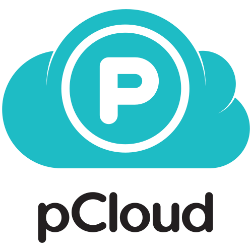
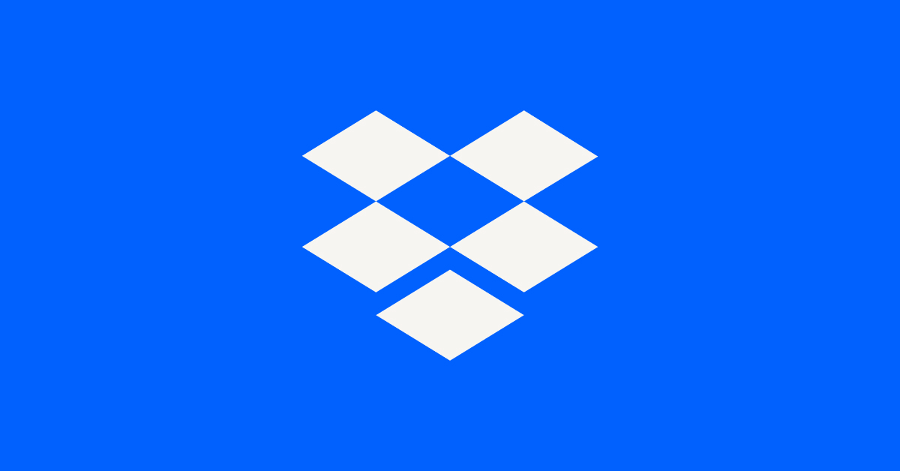
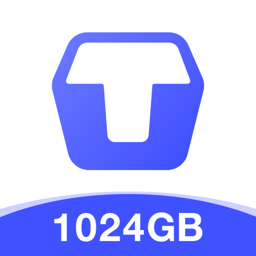
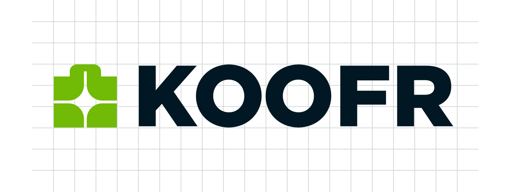

# 前言
最近因為專題，有許多大檔案需要傳輸，還要進行共編，雖然Google Drive有15GB的免費空間，但是如果只是用於共編，就有些浪費。畢竟工作和生活檔案想要分開，這邊整理幾個免費網路空間。

# [Goole Drive](https://www.google.com/drive/)

    
為每個Google帳號提供`15GB的免費儲存空間`，這些空間由Gmail、Google相簿和Google雲端硬碟共用。

**分享與下載限制：**
*   分享檔案沒有明確限制，但對於被大量下載的檔案，Google可能會實施`下載限制`直接不能下載。
*   共用設定彈性高，可以設定僅限特定人士存取、知道連結者皆可檢視/加註/編輯。

**額外功能：**
*   **Google全家桶：** 直接在瀏覽器中建立、編輯和協作Google文件、試算表和簡報，防止共編亂碼。

**缺點：**
*   **隱私疑慮：** Google可能會掃描儲存的內容用於廣告目的（儘管官方聲明已停止掃描Gmail用於廣告）。
*   **共用空間：** 15GB空間由多個服務共用。

# [OneDrive](https://www.microsoft.com/zh-tw/microsoft-365/onedrive/online-cloud-storage)

    
針對每個Microsoft帳號提供`5GB的免費儲存空間`，用於儲存檔案、文件和照片。
**分享與下載限制：**
*   可以彈性地設定檔案分享權限，如僅限特定人士存取、知道連結者皆可檢視或編輯。

**額外功能：
*   **Microsoft 365：** 直接與Word、Excel、PowerPoint等Office應用程式，防止共編亂碼。

**缺點：**
*   **功能與系統綁定：** 在非Windows作業系統上不好用。

# [Mega](https://mega.io/)

    
為每個帳號提供`20GB的免費儲存空間`。

**分享與下載限制：**
*   分享連結可以設定密碼保護或失效日期。
*   免費帳戶有 **頻寬限制**，例如`10 GB上傳下載頻寬限制/月，每半小時回補500MB流量 `的數據。

**缺點：**
*   **嚴格頻寬限制：** 免費帳戶的下載頻寬限制相對嚴格，頻繁下載大檔案會受到影響。
*   **帳戶重置風險：** 長時間不登入，帳號可能會被視為不活躍，可能導致免費空間減少或數據丟失（通常有警告）。

# [pCloud](https://www.pcloud.com/)

    
為每個帳號提供`3~10GB的免費儲存空間`，根據你完成任務給予相對應的空間，用於儲存各種檔案、照片和影片。
**分享與下載限制：**
*   可以建立公開或受保護的分享連結。

**額外功能：**
*   **終身空間：** 比較特殊的是方案都是買斷的。
*   **媒體串流：** 內建播放器，可以直接串流播放影片或照片。

**缺點：**
*   **免費空間麻煩但好用：** 要做活動才能到10GB。

# [Ente](https://ente.io/)

    
為每個帳號提供`10GB的免費儲存空間`，用於儲存各種檔案、照片和影片。

**分享與下載限制：**
*   可以建立公開或受保護的分享連結。

**額外功能：**
*   **邀請好友：** 可以新增10GB空間。

**缺點：**
*   **尚未完成翻譯：** 沒有繁體中文。

# [Box](https://www.box.com/zh-tw/home)

    
為每個帳號提供`10GB的免費儲存空間`。

**分享與下載限制：**
*    可設定分享權限，例如僅限受邀用戶、指定人員或連結存取。
*    免費帳戶`單一檔案大小限制為250MB`。

**額外功能：**
*    **電子簽名：** 內建Box Sign功能，可直接在雲端進行文件簽署。

**缺點：**
*   **單一檔案大小限制嚴格：** 免費帳戶單一檔案`大小限制為250MB`，對於大檔案儲存不便。
*   **主要面向企業用戶：** 免費功能相對有限，許多進階協作和管理功能僅限付費企業用戶。

# [Dropbox](https://www.dropbox.com/)

為每個帳號提供`2GB的免費儲存空間`，可以用於儲存和同步文件、照片和影片。

**分享與下載限制：**
*   可以輕鬆地建立檔案或資料夾分享連結，並設定唯讀或編輯權限。
*   對於大量下載，不會像其他服務那樣嚴格。

**額外功能：**
*   **Dropbox Paper：** 內建協作文件編輯工具，方便團隊共同作業。

**缺點：**
*   **付費升級價格高：** 若需更多空間，付費方案的價格通常比競爭對手高。

# [Sync](https://www.sync.com/)

為每個帳號提供`5GB的免費儲存空間`。

**分享與下載限制：**
*   可以建立安全分享連結，並可設定密碼保護和失效日期。

**缺點：**
*   **缺乏線上編輯功能：** 不提供文件、試算表或簡報的線上預覽或編輯工具，對於需要共編的用戶來說較不方便。

# [Filen](https://filen.io/)

為每個帳號提供`10GB的免費儲存空間`。

**分享與下載限制：**
*   提供安全的分享連結。

**額外功能：**
*   **開源客戶端：** 提供開源的應用程式，增加透明度和社群信任(雖然我都用網頁)。

**缺點：**
*   **服務較新：** 相對較新的服務，功能可能仍在完善中察。

# [Proton Drive](https://proton.me/drive/)

為每個帳號提供`2GB的免費儲存空間`。

**分享與下載限制：**
*   提供安全的分享連結，支援密碼保護。
*   作為加密服務，文件分享時需額外加密，可能影響分享速度。

**額外功能：**
*   **Proton全家桶：** 與Proton Mail、Proton Calendar等服務無縫整合。

**缺點：**
*   **尚未完成翻譯：** 沒有繁體中文。

# [TeraBox](https://www.terabox.com/)

    
為每個帳號提供`1TB (1024GB) 的免費儲存空間`，是目前市面上提供最大免費空間的服務之一。

**分享與下載限制：**
*   免費帳戶下載速度受限，尤其是在`下載大檔案時會非常慢(100kb)`。
*   單一檔案上傳大小對於免費用戶有嚴格限制 (例如 4GB)。

**額外功能：**
*   **遠端上傳：** 支援透過URL將檔案直接上傳到雲端，方便保存網路資源。
*   **線上播放：** 內建播放器，可以直接串流播放影片或音樂。

**缺點：**
*   **廣告較多：** 免費版應用程式或網頁介面可能包含較多廣告。
*   **隱私疑慮：** 對於資料的隱私和安全性方面，部分用戶存在疑慮。
*   **不活躍檔案刪除：** 長時間不活躍的帳戶或檔案可能被標記為不活躍，甚至可能被刪除。

# [ASUS WebStorage](https://www.asuswebstorage.com/)

    
為每個帳號提供`5GB的免費儲存空間`，特別為ASUS裝置用戶提供更好的整合體驗。

**分享與下載限制：**
*   可設定檔案分享連結，並可選擇公開或私密存取。
*   對於免費帳戶，`單一檔案上傳大小限制為2GB`。

**額外功能：**
*   **裝置整合：** 與ASUS筆記型電腦、手機等裝置深度整合，方便資料同步與備份。
*   **跨平台支援：** 支援多種作業系統和行動裝置應用程式。

**缺點：**
*   **品牌綁定：** 功能和體驗在非ASUS裝置上可能不如在ASUS裝置上流暢。

# [icedrive](https://www.icedrive.net/)

    
為每個帳號提供`10GB的免費儲存空間`。

**分享與下載限制：**
*   可以提供分享連結，並支援密碼保護。
*   免費帳戶有`每日3GB的下載流量限制`。

**額外功能：**
*   **虛擬磁碟機：** 可以將雲端儲存掛載為本地虛擬磁碟機，方便檔案管理。

**缺點：**
*   **相對較新：** 相比主流服務，功能仍在發展中。
*   **廣告：** 有廣告可能會很煩人。

# [Blomp](https://blomp.com/)

    
為每個帳號提供`40GB的免費儲存空間`。

**分享與下載限制：**
*   可以建立檔案或資料夾分享連結。
*   免費帳戶的下載速度受到嚴格限制，通常在`1-2 Mbps`左右。

**缺點：**
*   **速度限制：**
*   **隱私疑慮：** 對於新服務，資料隱私和安全性政策可能需要仔細評估。

# [MediaFire](https://www.mediafire.com/)

    
為每個帳號提供`10GB的免費儲存空間`，主要用於大檔案傳輸與分享。

**分享與下載限制：**
*   可以建立直接下載連結，並支援一次性連結。
*   免費帳戶下載頁面會顯示廣告。
*   若檔案`超過30天`無任何下載活動，可能被系統自動移除。

**額外功能：**
*   **無檔案大小限制：** 上傳單一檔案沒有嚴格大小限制（儘管超大檔案可能需要付費帳戶才能獲得較好的上傳體驗）。
*   **直接連結：** 方便分享檔案給非註冊用戶。

**缺點：**
*   **廣告數量多：** 免費用戶在使用服務時會遇到較多廣告，尤其是下載頁面。
*   **檔案移除風險：** 若檔案長時間不被下載，MediaFire可能會將其從伺服器上移除。
*   **缺乏進階功能：** 相較於其他服務，缺乏文件預覽、線上編輯或協作等進階功能。
*   **隱私與安全性：** 不提供加密。

# [Rakuten Drive](https://www.rakuten-drive.com/)

    
為每個帳號提供`10GB的免費儲存空間`，主要用於大檔案傳輸與分享。

**分享與下載限制：**
*   可以建立分享連結。
*   免費帳戶的下載速度限制為`10Mbps`，上傳速度也相對較慢。
*   分享的檔案在一段時間後`7天或30天`會自動失效或被刪除。

**缺點：**
*   **檔案自動失效：** 免費帳戶分享的檔案有自動失效期限，不適合長期儲存。
*   **廣告數量多：** 免費用戶在服務介面或傳輸過程中可能會遇到廣告。
*   **速度限制：** 免費用戶的傳輸速度可能較慢，影響大檔案體驗。
*   **儲存功能弱：** 更偏向於檔案傳輸工具，不適合作為長期備份空間。

# [Koofr](https://app.koofr.net/)

為每個帳號提供`10GB的免費儲存空間`，並獨特地支援整合其他雲端服務，如`Google Drive、Dropbox和OneDrive`。

**分享與下載限制：**
*   可以建立分享連結，且`每月分享流量限制為100GB`。

**額外功能：**
*   **多雲整合：** 允許將其他雲端儲存服務（如Google Drive、Dropbox、OneDrive）整合到Koofr中，(很卡🐵)。
*   **WebDAV支援：** 支援WebDAV協定，方便透過第三方應用程式存取檔案。

**缺點：**
*   **用戶社群較小：**

# [Jottacloud](https://jottacloud.com/)

提供`5GB的免費儲存空間`。

**分享與下載限制：**
*   可以建立檔案或資料夾分享連結，但免費帳戶的上傳和下載速度可能不穩定。

**缺點：**
*   **主要功能需付費：** 其核心的「無限備份」功能僅限付費方案。
*   **速度與介面：** 上傳下載速度可能不穩定，UI不如主流直觀。
*   **伺服器地點：** 伺服器位於挪威，可能對亞洲等地區用戶的連接速度有影響。
