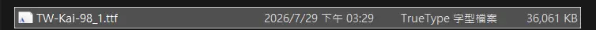
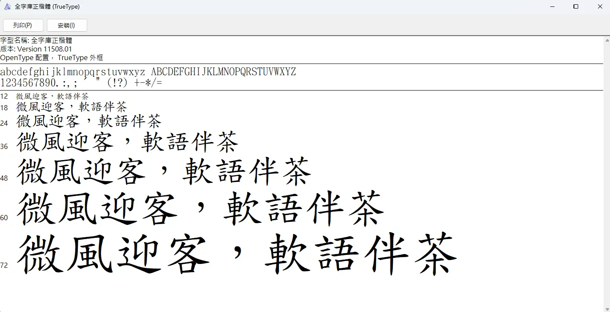
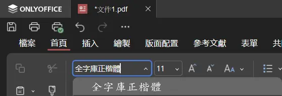

# 前言

從小到大，作業、報告、公文，只要是正式一點的文件，老師和長官都會告訴你「中文用標楷體，英文用 Times New Roman」。這句話大概已經被講了三十年，沒什麼人問過為什麼。

但標楷體不是公版字型。它的著作權在一家私人公司手上，嚴格說起來商業使用是要另外授權的。更尷尬的是，如果你用 Linux，你連裝都裝不到它，因為它從來沒有 Linux 版，它是靠微軟綁在 Windows 裡才變成全民預設的。

這篇想講清楚三件事：這個局面是怎麼出來的、規定到底有沒有真的叫你用標楷體、以及現在該用什麼。

# 標楷體是誰的

標楷體的源頭是教育部。民國七十五年教育部找了師大組成小組，把國字的標準寫法定下來，也就是「國字標準字體」。接著把做成數位字型的案子發包出去，華康科技在兩年後得標。

華康科技 1987 年創立於台灣，2001 年改名為威鋒數位開發股份有限公司，英文名 DynaComware Taiwan Inc.，總部在台北。同一年它在東京另外成立了日本法人 DynaComware Corporation。所以如果你在字型檔的版權欄位看到 DynaComware Corporation 覺得奇怪，那是同集團的日本分支，不是日本公司持有台灣的字型。

真正讓標楷體變成全民預設的其實不是政府，是微軟。華康把字型授權給微軟綁進繁體中文版 Windows，從此每台電腦開機就有，對使用者來說等於免費。這個「看起來免費」的狀態維持了二十幾年，久到大家忘記它其實有主人。

依著作權法，法人著作的著作財產權存續到公開發表後五十年。標楷體大約定案於 1990 年前後，推算保護期大概落在 2040 年代初期到期。

# 規定其實沒有叫你用標楷體

這是最多人搞錯的一點。

現行《政府文書格式參考規範》最新版是民國 105 年 4 月修正的，之後就沒再動過。裡面關於字型的規定原文是：

> 字型：中文採楷書，英文及阿拉伯數字採 Times New Roman 字體

寫的是「楷書」，不是「標楷體」。法規規範的是字體風格，從頭到尾沒有指名任何廠商的任何產品。

所以理論上，你用全字庫正楷體、用任何一套楷書字型，都完全符合規定。只是 Windows 字型清單裡那個選項就叫「標楷體」，大家點了三十年，政府也從來沒有公告過「你可以用別的」，於是條文留的活路沒有人走。

# 有人問過，兩次

第一次是 2016 年 5、6 月。立委吳思瑤在質詢文化部長鄭麗君時提出，公文一律用標楷體「毫無美感可言」，政府應該帶頭改。當時的討論集中在美感，有人撰文反駁，理由是標楷體用的是教育部標準字體、作業系統本來就附送所以不用另外買、字碼統一方便電子公文交換。

中間那條理由，「電腦附送，無須另外購置」，兩年後就出事了。

2018 年 8 月 14 日，一位網友在臉書貼出他與華康往來的信件，對方員工明確表示新細明體和標楷體要商業使用必須經華康授權。這件事在科技媒體上炸開，字嗨社團的柯志杰寫了整理文，指出華康實際上並沒有在追究這兩套字的使用者，發過律師函的都是其他華康字型，而微軟與華康之間的條款則是「撲朔迷離」。華康在 9 月 10 日發聲明，說從來沒有向創作者收過這兩套字的費用，也不會向合法授權的 Windows 使用者求償。

兩次都沒有改到規定。2018 年那次官方的處理方式是指著全字庫說「你可以用這個」，《政府文書格式參考規範》一個字都沒動，到今天還是 2016 年那一版。

# 如何下載

要替代標楷體，目前最合適的是國家發展委員會的**全字庫正楷體**。

它跟標楷體同樣是毛筆楷書路線，風格對得上，維基百科上直接寫它「與標楷體有相當的相似度，可作為商業上的代用，以避免爭議」。授權是政府資料開放授權，免費、可商用，只要註明出處。

收字量是它最大的優勢。全字庫的目標是把 CNS11643 整套標準交換碼的字都做出來，連罕用字、異體字都在裡面，這是一般商業字型和社群字型都做不到的規模。整個資料集除了字型檔，還包含字碼對照表、部首筆畫、異體字對應這些資料。

官方下載頁：<https://data.gov.tw/dataset/5961>

# 安裝

Windows 和 macOS 沒什麼好講。

下載解壓縮之後點兩下安裝就好。

這邊還沒研究Linux，之後會補上。

Only Office就可以選到字型

# 結語

回頭看，統一這件事本身沒有錯。教育部把國字該怎麼寫定下來，那是真正的公共財，而且法規規範的也確實只是「楷書」這個風格。

跑掉的是實作那一層。九〇年代要畫出一萬三千多個字，成本高到只有商業字型廠做得出來，微軟再把它綁進系統，於是大家實際上統一的不是「楷書」這個規格，而是某一家公司的那一顆檔案。規格是開的，實作是鎖的，中間那段落差沒人管，因為在它被戳破之前，它看起來是免費的。

政府後來其實把開放的那份補上了，全字庫做得又大又完整。但規範沒改、沒有公告、沒有人被告知可以用，結果就是名義上開放、實際上還綁在原地，兩邊的壞處都拿到了。

標楷體的著作權大概 2040 年代才會到期。在那之前，至少你知道有別的選擇。

# 參考資料

- [政府文書格式參考規範（105年4月修正）- 國家發展委員會檔案管理局](https://www.archives.gov.tw/tw/arctw/156-3145.html)
- [標楷體 - 維基百科](https://zh.wikipedia.org/wiki/標楷體)
- [DynaComware - Wikipedia](https://en.wikipedia.org/wiki/DynaComware)
- [Windows 裡的新細明體和標楷體無法用於營利或商業用途 - Max的每一天](https://max-everyday.com/2018/08/dfkai-sb-font-famil/)
- [時事／標楷體、新細明體不可商業使用，創作人怎麼取得合法字型？ - 硬是要學](https://www.soft4fun.net/tech/news/時事／標楷體、新細明體不可商業使用，創作人怎.htm)
- [標楷體的公文書 - 夏老師的部落格](https://blog.udn.com/chhsia1113/60108666)
- [CNS11643 中文標準交換碼全字庫](https://www.cns11643.gov.tw/)
- [CNS11643中文標準交換碼全字庫 - 政府資料開放平臺](https://data.gov.tw/dataset/5961)
- [芫荽 Iansui - GitHub](https://github.com/ButTaiwan/iansui)
- [霞鶩文楷 TC - GitHub](https://github.com/lxgw/LxgwWenkaiTC)
- [著作權保護期間有多長？ - 著作權筆記](https://www.copyrightnote.org/ArticleContent.aspx?ID=3&aid=533)